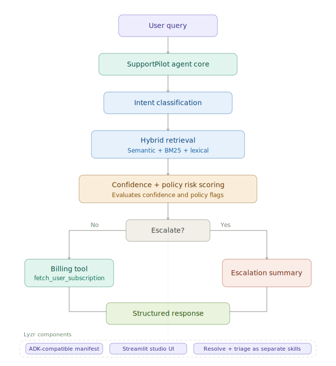

# SupportPilot Agent

> Grounded support answers with confidence scoring, citation transparency, and risk-aware escalation — built for the [Lyzr GitAgent Challenge](https://github.com/open-gitagent/gitagent).

[](https://github.com/open-gitagent/gitagent)
[](https://python.org)
[](./LICENSE)
[](reports/audits/RED_TEAM_SECURITY_AUDIT.md)

---

## What This Agent Does

Most support bots give confident answers even when they shouldn't. SupportPilot does the opposite — it tells you *how confident it is*, shows you *why* (citations), and escalates when it genuinely doesn't know.

- Resolves common support questions from a grounded FAQ knowledge base
- Uses hybrid retrieval to reduce single-method blind spots
- Returns confidence scores and citations instead of opaque answers
- Escalates ambiguous, high-risk, or policy-conflict queries with structured reason codes
- Preserves recent conversational context for multi-turn follow-ups

---

## Architecture




**Lyzr Components:** Lyzr ADK · Knowledge Base · Memory · Escalation Triage

---

## Evaluation Snapshot

> Source: [`evaluation_results.json`](evaluation_results.json)

| Metric | Value |
|---|---|
| Total prompts evaluated | 25 |
| Grounded answer rate | 100% |
| Escalation accuracy | 92% |
| Median latency | 38.56 ms |

---

## GitAgent Manifest Compliance

> Source: [`agent.yaml`](agent.yaml)

| Field | Value |
|---|---|
| `spec_version` | 0.1.0 |
| `name` | supportpilot-agent |
| `version` | 0.1.0 |
| `skills` | support-resolution, escalation-triage |
| `tools` | `[]` declared (see known limitations) |
| `runtime.max_turns` | 20 |
| `runtime.timeout_s` | 120 |

> **Note:** Runtime includes an internal billing helper path (`fetch_user_subscription`) while manifest `tools` is currently empty. This declaration-runtime drift is tracked as **B-001** in the bug report and is the top remediation priority.

---

## Repository Structure

```
.
├── agent.yaml                          # GitAgent manifest
├── requirements.txt
├── evaluation_results.json
│
├── src/
│   ├── support_agent.py                # Core agent runtime
│   ├── evaluate.py                     # Benchmark harness
│   ├── demo_app.py                     # Streamlit demo UI
│   └── validate_gitagent_structure.py  # Compliance validator
│
├── data/
│   └── faq_kb.md                       # Knowledge base
│
├── docs/
│   ├── ARCHITECTURE.md
│   └── FAILURE_ANALYSIS.md
│
├── tests/
│   ├── test_red_team_security.py       # 13 attack scenarios
│   └── test_stateful_correctness.py   # 17 distributed systems tests
│
└── reports/
    ├── audits/
    │   ├── RED_TEAM_SECURITY_AUDIT.md
    │   └── STATEFUL_CORRECTNESS_AUDIT.md
    └── submission/
        └── GITAGENT_BUG_REPORT_ANALYSIS_SUBMISSION.md
```

---

## Setup & Installation

**Prerequisites:** Python 3.10+, pip, optional HF token for faster model pulls

```bash
# 1. Clone
git clone https://github.com/Satyam999999/Supportpilot-Gitagent.git
cd Supportpilot-Gitagent

# 2. Virtual environment
python3 -m venv .venv
source .venv/bin/activate        # Windows: .venv\Scripts\activate

# 3. Install dependencies
pip install -r requirements.txt

# 4. Optional: HF token for faster model pulls
echo "HF_TOKEN=your_token_here" > .env
```

---

## Run

```bash
# CLI agent
python src/support_agent.py

# Streamlit demo UI
streamlit run src/demo_app.py

# Evaluation benchmark
python src/evaluate.py

# GitAgent structure validation
python src/validate_gitagent_structure.py
```

---

## Tool Reference

### `fetch_user_subscription` *(internal runtime helper)*

| Parameter | Type | Description |
|---|---|---|
| `user_id` | `string` | User identifier |

**Returns:** `{"plan": string, "status": string}`

| Field | Possible Values |
|---|---|
| `plan` | `"Pro"`, `"Starter"`, `"Unknown"` |
| `status` | `"active"`, `"trial"`, `"unverified"` |

> No external network call in current MVP. Uses in-memory lookup. Returns explicit `"unverified"` status for unknown users. Not yet declared in manifest — tracked as B-001.

---

## Security & Audit Reports

This submission goes beyond happy-path testing. All vulnerabilities were confirmed with reproducible test cases and proof-of-concept exploits.

| Report | Scope | Findings |
|---|---|---|
| [Bug Report & Submission](reports/submission/GITAGENT_BUG_REPORT_ANALYSIS_SUBMISSION.md) | Master report — 12 bugs across 5 layers | 4 Critical · 5 High · 3 Medium |
| [Red Team Security Audit](reports/audits/RED_TEAM_SECURITY_AUDIT.md) | 13 attack scenarios with PoC exploits | Tool injection · KB poisoning · Registry tampering |
| [Stateful Correctness Audit](reports/audits/STATEFUL_CORRECTNESS_AUDIT.md) | 17 distributed systems test cases | Memory bleed · Idempotency · Partial execution state |

```bash
# Run security red-team suite
pytest tests/test_red_team_security.py -v

# Run stateful correctness suite
pytest tests/test_stateful_correctness.py -v
```

---

## Known Limitations

| # | Limitation | Tracked In |
|---|---|---|
| 1 | Manifest declares no tools while one internal billing helper runs at runtime | B-001 |
| 2 | Memory is list-based with hard truncation — long sessions (15+ turns) lose early context | B-004 |
| 3 | Tool output and KB content are not sanitized — injection risk under adversarial inputs | B-007, B-008 |
| 4 | Intent classification is heuristic and can be steered via keyword stuffing | B-009 |
| 5 | Registry manifest trust relies on schema shape only — no cryptographic verification | B-012 |

---

## Bugs Found During Development

**Fixed before submission:**

1. Added hybrid retrieval fallback to reduce misses on wording variance
2. Added confidence + citation output so weak grounding is visible
3. Added escalation reason codes for risky and policy-conflict paths
4. Added query rewriting for ambiguous follow-up turns
5. Added benchmark harness and GitAgent structure validator for repeatable checks

**Known open issues** — documented, reproducible, with recommended fixes:

See [reports/submission/GITAGENT_BUG_REPORT_ANALYSIS_SUBMISSION.md](reports/submission/GITAGENT_BUG_REPORT_ANALYSIS_SUBMISSION.md) for the full 12-bug report with severity ratings, reproduction steps.

---

## Star the GitAgent Repo

If this submission was useful, please star the GitAgent standard repo:
**[https://github.com/open-gitagent/gitagent](https://github.com/open-gitagent/gitagent)**

---

## License

MIT — see [LICENSE](./LICENSE)

---

*Built by Satyam Ghosh for the Lyzr GitAgent Challenge · [#LyzrGitAgentChallenge](https://www.linkedin.com/)*
