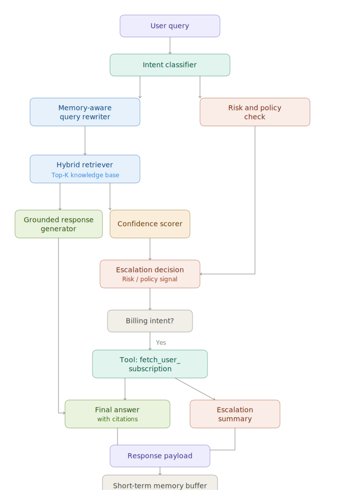

# SupportPilot Architecture

## System Diagram

## Components
1. Intent Classifier: tags each query as billing, account, technical, policy, or other.
2. Memory-Aware Query Rewriter: prepends context from recent turns to resolve ambiguous follow-ups.
3. Hybrid Retriever: combines semantic embeddings, BM25, and lexical cosine fallback.
4. Tool Layer: conditionally fetches user subscription details for billing-safe flows.
5. Confidence Scorer: combines retrieval strength, citation coverage, and risk penalties.
6. Risk and Policy Check: identifies high-risk requests and policy conflicts.
7. Escalation Decision: escalates on low confidence, risk indicators, or explicit human request.
8. Memory Buffer: stores recent queries for short context continuity.

## Response Contract
- answer
- confidence
- confidence_reason
- citations
- category
- escalate
- escalation_summary
- escalation_reasons
- rewritten_query
- tool_data
